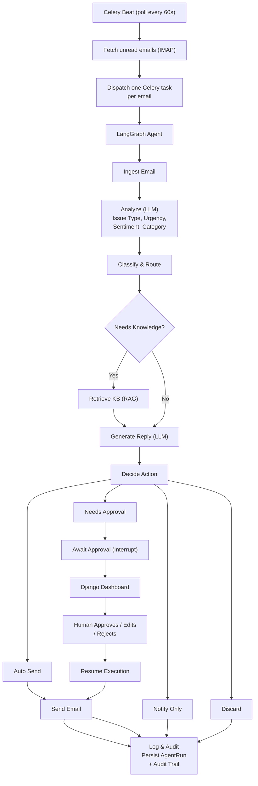

## Agentic Email System

## Overview

An AI-powered email support agent that reads incoming emails, analyzes intent/urgency/sentiment, retrieves relevant context from a knowledge base (if required), drafts a reply, and either auto-sends, escalates for human approval, or notifies a human — all orchestrated as a stateful LangGraph workflow with checkpointing, so execution can pause (e.g. waiting on human approval) and resume exactly where it left off.

## Tech Stack

- **Backend**: Django
- **Agent** orchestration: LangGraph (StateGraph, conditional edges, interrupt())
- **LLM**: Qwen 2.5 (7B Instruct), via Hugging Face's inference router (OpenAI-compatible API)
- **RAG** **/ Vector search**: PostgreSQL + pgvector (HNSW index), sentence-transformers (all-MiniLM-L6-v2) for embeddings
- **PDF ingestion**: pypdf, custom section-aware chunker (splits on "Day N" headers, falls back to fixed-size chunking)
- **Checkpointing / state persistence**: LangGraph's PostgresSaver (same Postgres instance as Django)
- **Async task processing**: Celery + Redis (broker/result backend), Celery Beat for scheduled polling
- **Email**: Gmail via IMAP (fetch, imaplib) and SMTP (send, smtplib), app-password auth
- **Dashboard**: Django server-rendered views/templates (approval queue + review/decide UI)

**<h2>Architecture</h2>**



## Setup (Local Development)

### 1. Install dependencies

```bash
pip install django langgraph langgraph-checkpoint-postgres pgvector openai \
            sentence-transformers pypdf celery redis python-dotenv
```

### 2. Configure environment variables

Create a `.env` file in the project root.

```env
HF_TOKEN=hf_xxx
GMAIL_ADDRESS=you@gmail.com
GMAIL_APP_PASSWORD=xxxx xxxx xxxx xxxx
```

### 3. Enable the pgvector extension

```sql
CREATE EXTENSION IF NOT EXISTS vector;
```

### 4. Run database migrations

```bash
python manage.py migrate
```

### 5. Ingest your knowledge base

```bash
python manage.py ingest_kb_pdf /path/to/itinerary.pdf --title "Trip Name"
```

### 6. Start the services

Open three terminals.

**Terminal 1**

```bash
celery -A mail_agent worker -l info
```

**Terminal 2**

```bash
celery -A mail_agent beat -l info
```

**Terminal 3**

```bash
python manage.py runserver
```

